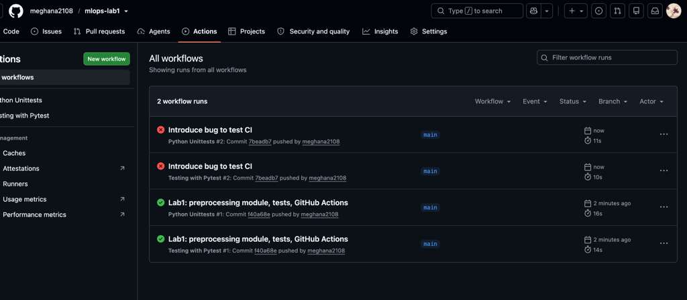
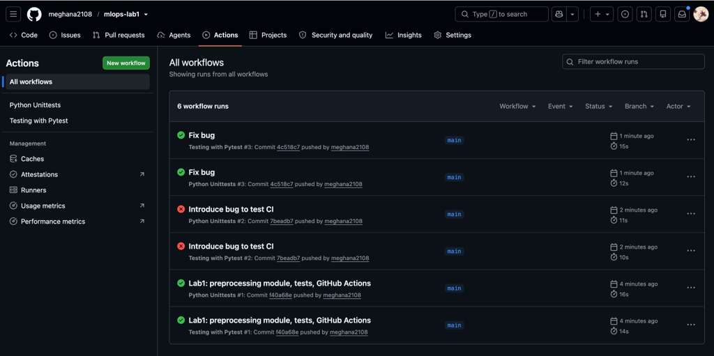

# MLOps Lab 1 — Data Preprocessing with CI Testing


Lab 1 for **IE-7374 MLOps**. A small data-preprocessing module, tested with
**pytest** and **unittest**, and automatically checked on every push using
**GitHub Actions**.

## Functions (`src/preprocessing.py`)

| Function | Description |
|---|---|
| `mean(values)` | Average of a list |
| `std(values)` | Population standard deviation |
| `min_max_scale(values)` | Scales values to the range [0, 1] |
| `z_score(values)` | Standardizes values to mean 0, std 1 |
| `train_test_split(data, test_ratio)` | Splits data into train and test sets |
| `load_csv_column(path, column)` | Reads a numeric column from a CSV file |

## Setup

```bash
git clone https://github.com/meghana2108/mlops-lab1.git
cd mlops-lab1
python3 -m venv lab_01
source lab_01/bin/activate        # Windows: lab_01\Scripts\activate
pip install -r requirements.txt
```

## Running Tests

```bash
python -m pytest test/test_pytest.py -v      # 10 tests
python -m unittest test.test_unittest -v     # 7 tests
```

## GitHub Actions

Both workflows run on every push to `main`:

- **Testing with Pytest** — runs pytest and uploads `pytest-report.xml` as a build artifact (`test-results`).
- **Python Unittests** — runs the unittest suite.

A failing test marks the workflow as failed, so broken code is caught automatically.

## Screenshots

**CI catching a bug.** A bug was intentionally introduced in `min_max_scale`, and both workflows failed.



**Full CI cycle.** Initial commit passes, the bug commit fails, and the fix commit passes again.


